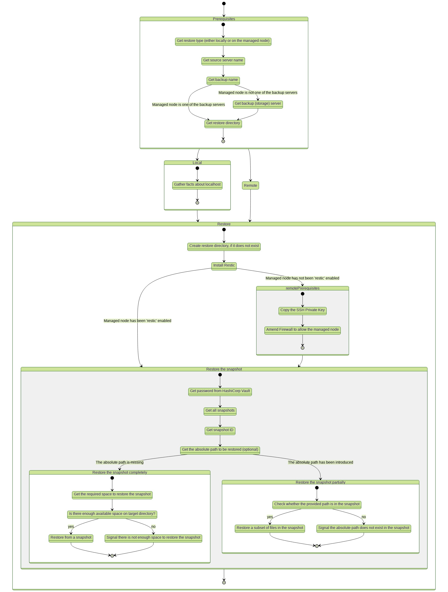

# Overview

This Ansible Role [restores](https://restic.readthedocs.io/en/latest/050_restore.html#restoring-from-a-snapshot) the contents of a given snapshot to a target directory on the managed node.

This documentation intends to provide a compendious overview to determine how restoring a backup works.

# How It Works

The `bckrestore` Role will restore an existing snapshot either locally (the `control node` in Ansible terms) or on any other server which is managed with Ansible (`managed nodes`).
A managed node could be the server whose snapshot we aim to restore, a designated backup (storage) server or a new server which is not part of the current setup. The later is particularly helpful in case of Migration or Disaster Recovery Operations, when we need to bring a node back to a certain state (as saved using `restic`).



# Prerequisites

- Python 3.8 and newer.
- Latest Ansible version. It is recommended to either install or upgrade Ansible using [`pip`](https://docs.ansible.com/ansible/latest/installation_guide/intro_installation.html#installing-and-upgrading-ansible-with-pip)

## modules

Install modules required to manage Hashicorp Vault:
```bash
$ pip install ansible-modules-hashivault hvac requests
```

## Environment

Prior to using this Role, we need to export a few environment variables related to HashiCorp Vault.

Address of the Vault server expressed as a URL and port.
```bash
export VAULT_ADDR=http://127.0.0.1:8200
```

Token used for authentication within Vault.
```bash
export VAULT_TOKEN=*.************************
```
# Variables 
* on_localhost: a Boolean which determines whether the restore is performed on localhost or not.
* source_server: a String which specifies the server whose snapshot is to be restored.
* backup_name: a String which specifies the backup name, as defined by the the restic variable in the corresponding host_vars file.
* backup_server: a String which specifies one of the enabled backup servers.
* restore_directory: a String which specifies where the data is to be restored.
* snapshot (optional): a String which specifies the Snapshot ID to be restored. In case this is omitted (empty string), then the variable will fall back to latest.
* absolute_path (optional): a String which specifies the absolute path in the snapshot of the file(s) or directory(ies) to be restored. In case this is omitted (empty string), then the entire snapshot is to be restored.

# Using the `bckrestore` Ansible Role

## Restore a backup (snapshot) locally

Certain tasks require `sudo` privileges, and this is why one needs to provide the `sudo` password as well.

```bash
$ ansible-playbook -i inventory/hashitalks -l cl2 plays/bckrestore.yml

PLAY [all] ******************************************************************************************************************************************************************************************************************************************************************************************************************

TASK [Gathering Facts] ******************************************************************************************************************************************************************************************************************************************************************************************************
ok: [cl2]

TASK [Add the source server to the ansible-playbook in-memory inventory] ****************************************************************************************************************************************************************************************************************************************************
ok: [cl2]

TASK [Gather facts about localhost] *****************************************************************************************************************************************************************************************************************************************************************************************
ok: [cl2 -> localhost]

TASK [bckrestore : Create "/tmp/hashitalks" directory, if it does not exist] ************************************************************************************************************************************************************************************************************************************************
ok: [cl2 -> localhost]

TASK [bckrestore : Install restic (if this is missing) on localhost] ********************************************************************************************************************************************************************************************************************************************************
included: /home/grassharper/repos/unfriendlygrinch/HashiTalks2022/ansible/roles/bckrestore/tasks/install_to_localhost.yml for cl2

TASK [bckrestore : Install restic on Debian] ********************************************************************************************************************************************************************************************************************************************************************************
ok: [cl2 -> localhost]

TASK [bckrestore : Set new variables] ***************************************************************************************************************************************************************************************************************************************************************************************
ok: [cl2 -> localhost] => (item=/home/grassharper/repos/unfriendlygrinch/HashiTalks2022/ansible/roles/bckrestore/files/../files/id_ecdsa)

TASK [bckrestore : Set backup server (index) variable to be used in the next tasks] *****************************************************************************************************************************************************************************************************************************************
ok: [cl2 -> localhost]

TASK [bckrestore : Set backup name (index) variable to be used in the next tasks] *******************************************************************************************************************************************************************************************************************************************
ok: [cl2 -> localhost]

TASK [bckrestore : Gather facts about the backup server] ********************************************************************************************************************************************************************************************************************************************************************
ok: [cl2 -> 10.0.10.43]

TASK [bckrestore : Set new variables] ***************************************************************************************************************************************************************************************************************************************************************************************
ok: [cl2 -> localhost]

TASK [bckrestore : Get password from HashiCorp Vault] ***********************************************************************************************************************************************************************************************************************************************************************
ok: [cl2 -> localhost]

TASK [bckrestore : Set snapshot ID] *****************************************************************************************************************************************************************************************************************************************************************************************
ok: [cl2 -> localhost]

TASK [bckrestore : Set the absolute path to be restored] ********************************************************************************************************************************************************************************************************************************************************************
ok: [cl2 -> localhost]

TASK [bckrestore : Get the required space to restore the snapshot] **********************************************************************************************************************************************************************************************************************************************************
ok: [cl2 -> localhost]

TASK [bckrestore : Get the available space on target directory] *************************************************************************************************************************************************************************************************************************************************************
ok: [cl2 -> localhost]

TASK [bckrestore : Restore from a snapshot] *********************************************************************************************************************************************************************************************************************************************************************************
changed: [cl2 -> localhost]

PLAY RECAP ******************************************************************************************************************************************************************************************************************************************************************************************************************
cl2                        : ok=17   changed=1    unreachable=0    failed=0    skipped=19   rescued=0    ignored=0   
```

```bash
$ ll /tmp/hashitalks/data/
total 16K
-rw-r--r--. 1 root root 8,2K feb  9 15:52 hashi.png
-rw-r--r--. 1 root root  264 feb  9 15:52 index.html
```

# License

**BSD**

# Author Information

- [Elif Samedin](elif.samedin@eaudeweb.ro)
- [Andrei Buzoianu](andrei@buzoianu.info)
